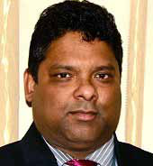
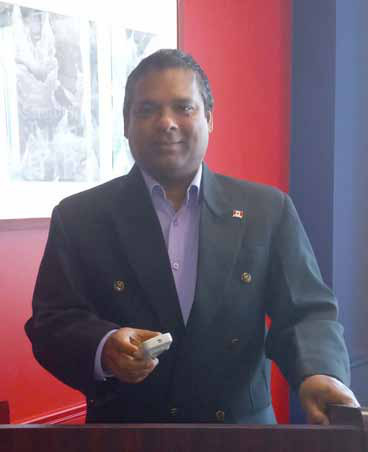
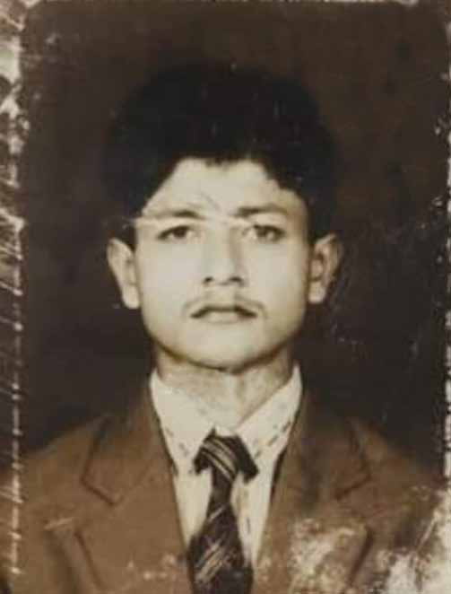
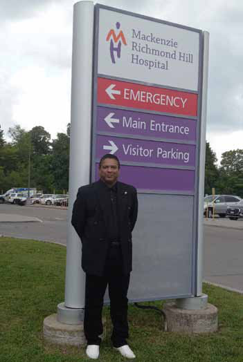
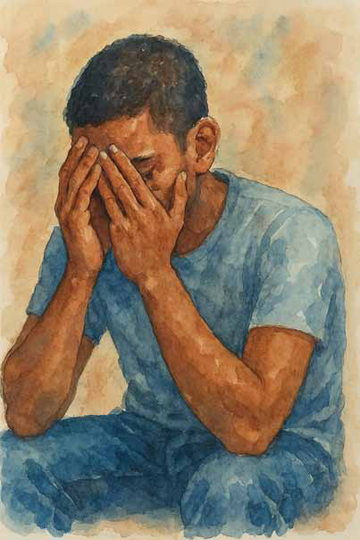

# D r. Ruwan M. Jayatunge is a Sri Lankan- born medical doctor and mental health professional whose work has spanned continents and conflict zones. A former commissioned officer in the Sri Lankan Army, he treated soldiers at the Colombo Military Hospital, becoming one of the first in the country to study and document the psychosocial effects of PTSD.

Jaffna Monitor
hellojaffnamonitor@gmail.com
42
D
r. Ruwan M. Jayatunge is a Sri Lankan-
born medical doctor and mental health 
professional whose work has spanned 
continents and conflict zones. A former 
commissioned officer in the Sri Lankan 
Army, he treated soldiers at the Colombo 
Military Hospital, becoming one of the first 
in the country to study and document the 
psychosocial effects of PTSD.
With advanced training in psychiatry, trauma-
informed therapy, addiction psychology, and 
neuropsychology from institutions in Canada, 
the UK, and the USA—including Harvard 
and the University of Toronto—Dr. Jayatunge 
brings a rare blend of field experience 
and academic insight. He holds a PhD in 
Psychology and has authored numerous books 
and peer-reviewed articles in collaboration 
with global experts, including Prof. Daya 
Somasundaram and Dr. Neil Fernando.
Today, he serves as the Clinical Director 
of Maple Cerendib Rehab in Canada and 
supervises internships for the University 
at Buffalo. A member of the American 
Psychological Association and the PTED 
International Scientific Committee, Dr. 
Jayatunge continues to lecture globally on war 
trauma, PTSD, and healing.
Do you feel the state and public health 
system adequately responded to the 
civilian mental health crisis following 
the war? What, in your opinion, could 
have been done differently?
Unfortunately, the state and public health 
system failed to adequately address the mental 
health crisis that emerged from the armed 
conflict. A significant number of psychological 
casualties remain—among military personnel, 
former LTTE members, and civilians alike. 
Many trauma-related psychological wounds 
remain unhealed, undiagnosed, and untreated.
Our society continues to bear the deep scars of 
war trauma, which manifest in various forms 
such as self-harm, social unrest, crime, child 
abuse, domestic violence, substance addiction, 
and political violence. These are not isolated 
issues—they are symptoms of a society 
grappling with unresolved psychological pain.
We are living in a traumatized society 
that urgently needs healing, structured 
psychosocial support, and genuine 
reconciliation.
Is there sufficient mental health 
support for trauma victims today 
in government hospitals and public 
clinics in conflict-affected areas?
There is a prevailing notion among authorities 
BY: 
Our Special Correspondent
Dr. Ruwan M. Jayatunge

Jaffna Monitor
hellojaffnamonitor@gmail.com
43
that the armed conflict ended in 2009, and 
therefore, there is no longer a need to address 
war-related issues. This mindset has led to 
a convenient forgetting of the psychological 
and social consequences of the war. However, 
the reality is quite different. We are still not 
providing adequate support or treatment for 
war victims.
The trauma of war continues to echo across 
Sri Lankan society. The conflict has become 
embedded in our collective social experience 
and memory. Many of the social problems we 
face today—whether directly or indirectly—
are rooted in unresolved war trauma.
Based on your experience in trauma 
psychology, how deep and widespread 
is untreated combat trauma among Sri 
Lankan soldiers after 2009?
The very first study on Post-Traumatic 
Stress Disorder (PTSD) among Sri Lankan 
combatants was conducted by Dr. Neil 
Fernando, Consultant Psychiatrist to the Sri 
Lanka Army, and myself. Between 2002 and 
2006, we clinically interviewed 824 soldiers 
who had been referred to the psychiatric unit 
of the military hospital, using the DSM-IV 
criteria. From this group, we identified 56 
individuals with full-blown PTSD.
However, it's crucial to note that our sample 
was not randomly selected. These were not 
ordinary troops but individuals who had 
already exhibited psychological red flags—
such as symptoms of depression, sudden 
behavioral changes, disciplinary issues, or 
psychosomatic complaints. They had been 
referred specifically for psychiatric evaluation, 
meaning our study did not capture the broader 
prevalence of PTSD among the military.
In reality, we believe the incidence of PTSD 
among soldiers rose significantly by 2009, and 
likely escalated further after the war ended. A 
substantial number of combatants continue 
to suffer from war-induced psychological 
distress—many of them undiagnosed, 
untreated, and enduring their pain in 
silence. Delayed PTSD is a well-documented 
phenomenon, and it remains a critical concern 
in post-conflict settings like Sri Lanka.
Throughout the war, soldiers were repeatedly 
exposed to severe psychological trauma. 
Most acute stress reactions went unnoticed 
or unaddressed. Emotional overwhelm was 
common, yet there was no robust system 
in place to detect trauma early or provide 
psychological first aid. Many soldiers 
continued to operate in high-stress combat 
zones, quietly carrying the burden of invisible 
wounds. For some, the diagnosis of PTSD 
came only years later.
A particularly stark indicator of this mental 
health crisis emerged in the immediate 
aftermath of the war. Between 2009 and 
2012, the military spokesman confirmed that 
nearly 400 soldiers had died by suicide. This 
staggering figure offers just a glimpse into 
the depth and scale of psychological trauma 
borne by our servicemen. Even today, we hear 
of ex-servicemen involved in violent crimes 
or social disturbances. These visible cases are 
only the tip of the iceberg. Beneath them lies 
a vast, largely hidden crisis of unaddressed 
psychological trauma among Sri Lanka’s war 
veterans.
In what ways does unresolved trauma 
among ex-soldiers manifest in civilian 
life—particularly in terms of violence, 
substance abuse, or erratic behavior?
It is like a time bomb—it may remain hidden 
for years, but it can explode unexpectedly,

Jaffna Monitor
hellojaffnamonitor@gmail.com
44
harming not only the ex-combatant but also 
their family members and others around them. 
These deep, untreated mental wounds don’t 
always stay buried. They often resurface in 
various ways—sometimes as aggression, either 
turned inward as self-harm or outward toward 
others.
Family and relationship problems are 
common. Many struggle to reintegrate into 
society, often feeling alienated or emotionally 
distant. They may turn to addictive behaviors 
to cope, while also avoiding people, situations, 
or even memories that trigger their pain. 
Occupational challenges are frequent, as 
are distorted beliefs about themselves and 
the world around them. Alarmingly, some 
begin to distrust the very systems designed to 
support them—including healthcare providers 
and therapists.
There’s also a recurring sense of being re-
victimized, accompanied by an overwhelming 
need to constantly protect themselves. In 
some cases, this leads to attempts to control 
or even victimize others. On a deeper level, 
many lose their core beliefs, and their inner 
sense of identity. They grapple with intense 
emotions—rage, despair, guilt, shame, and 
deep self-loathing—yet find it hard to express 
what they’re going through. Some even suffer 
from alexithymia, the inability to describe 
their feelings in words.
Have you encountered signs of 
institutional or collective denial in 
addressing the psychological impact 
on Sri Lankan soldiers? Why do you 
think this remains under-addressed?
For a number of years, the Sri Lankan 
authorities were reluctant to believe that 
combat-related PTSD was emerging in the 
military. PTSD was regarded as an American 
illness, and there was an unofficial taboo to 
use the term PTSD. The tension of combat 
trauma was mounting in the military over 
the years, and there had been suicides and 
self-harms reported from the battlefields. The 
soldiers affected by war trauma had behavioral 
problems, and their productivity was 
plummeting. Many soldiers who had positive 
features of combat-related PTSD without any 
physical wounds were compelled to serve in 
the operational areas and engage in active 
combat. They were psychologically wounded 
soldiers with severe avoidance.
In the early days of the war, soldiers were 
sometimes charged with malingering when 
they tried to seek medical attention. Because 
of this Many traumatized veterans deserted the 
army or joined underworld criminal gangs. 
Throughout the war, the Army had no military 
psychologists and had no full-time psychiatrist 
until 2007. Major concern was placed on 
physical wounds, and psychological wounds 
were not taken seriously. These factors caused 
a higher number of psychological casualties in 
the military.

Jaffna Monitor
hellojaffnamonitor@gmail.com
45
In an interview with Jaffna Monitor, 
former Army Major General Lakshman 
David stated that the military should 
have been rehabilitated just like 
surrendered LTTE cadres. What is 
your view on this? Why do you think 
successive governments failed to 
initiate meaningful rehabilitation for 
military personnel?
There was no effective psychological debriefing 
system in place following traumatic military 
operations. Likewise, there was no proper 
screening process for combat trauma. As 
a result, many military personnel who 
experienced severe psychological stress 
went without the support they desperately 
needed. These individuals left the military 
undiagnosed and untreated, carrying the 
weight of their emotional wounds into their 
homes and families.
Sri Lanka lacked a structured system to 
support the transition of veterans back into 
civilian life. This absence created significant 
readjustment difficulties for former 
combatants, many of whom struggled to 
reintegrate into society. They faced a wide 
range of emotional and social challenges as 
they attempted to rebuild their lives outside 
the military.
It’s important to recognize that the impact 
of combat stress does not always surface 
immediately. In the postwar era, delayed 
reactions to trauma are common, and 
symptoms of Post-Traumatic Stress Disorder 
(PTSD) can emerge long after the initial 
exposure. For some veterans, these residual 
effects can become serious, long-term mental 
health issues, often developing years after their 
service has ended.
We’ve seen a rise in violent incidents 
involving former soldiers, including 
recent shootings. Do you believe there 
is a direct link between these acts and 
unresolved combat trauma — such as 
PTSD, moral injury, or other complex 
psychological conditions?
Some traumatized individuals experience 
a compulsive urge to re-expose themselves 
to situations that resemble their original 
trauma—this phenomenon is known as 
“compulsive exposure.” It is a distinctive 
marker of combat-related Post-Traumatic 
Stress Disorder (PTSD).
Soldiers suffering from war trauma may later 
become involved in violence or criminal 
behavior. This pattern has been observed in 
various post-conflict societies, including the 
period following the Vietnam War. When 
combat trauma goes untreated, it can become 
a vicious cycle, increasing the risk that affected 
ex-soldiers will engage in acts of social 
violence and criminality.
One example from Sri Lanka is Malavi 
Kankanamage Jinasena, also known as "Army 
Jiné." A former Commando with exceptional 
combat skills, Jiné served in the elite Sri Lanka 
Army unit. However, as a result of intense 
combat stress, his behavior deteriorated. 
He was eventually charged with multiple 
disciplinary violations and went AWOL 
(Absent Without Leave).
While living in hiding, Jiné used his military 
survival training to evade law enforcement 
and sustain a life of crime. He was implicated 
in numerous violent acts, including highway 
robberies, murders, and sexual assaults. 
According to some reports, he was responsible

Jaffna Monitor
hellojaffnamonitor@gmail.com
46
for as many as 27 rapes. Jiné lived deep in the 
jungle for years before he was finally tracked 
down and killed by police.
Does Sri Lanka have the institutional 
capacity to track or support army 
deserters today? Or has the country 
created a “lost generation” of 
men trained for war but denied 
reintegration or care?
I think we have the institutional capacity to 
track or support army deserters. It can be done 
with knowledgeable professionals and officers 
with empathy. These army deserters have 
postwar war readjustment problems and are 
experiencing issues with their living, working, 
and social environments. They need individual 
therapy, family therapy, and psychosocial 
rehabilitation.
Do you think stigma within the military 
— especially around admitting 
emotional vulnerability — has 
worsened the psychological toll on 
soldiers? How can this barrier be 
broken?
Indeed. War trauma is often associated 
with stigma, and some individuals with 
combat trauma were reluctant to come for 
psychological services. They feared it would 
affect their dignity and military career. We 
have detected PTSD reactions among the 
senior military officers, and yet they did not 
seek professional support. Some of them were 
compelled to come for treatment when these 
stresses became unbearable and when their 
lives were at risk.
Has the state, in your opinion, failed 
its own armed forces by not providing 
adequate postwar rehabilitation and 
reintegration support?
I would say that, as a nation, we failed to 
provide adequate post-war rehabilitation and 
reintegration support to the soldiers who 
fought in the 30-year armed conflict.
If you were advising the Sri Lankan 
state today, what would be the most 
urgent steps to prevent future violence 
from traumatized ex-soldiers and to 
reintegrate them constructively into 
society?
I would restructure the Rehabilitation 
Department and recruit knowledgeable 
and empathetic professionals to work with 
war-affected individuals. It is essential to 
train personnel from both the military 
and health sectors, equipping them with a 
Army Jiné

Jaffna Monitor
hellojaffnamonitor@gmail.com
47
deep understanding of war trauma and its 
psychological and social consequences.
We need to provide specialized training for 
those working in the military’s psychological 
and psychiatric units. This should include 
identifying early signs of combat trauma in 
soldiers, preventing issues such as desertion 
or criminal behavior, and improving 
the recruitment process by selecting 
psychologically stable individuals for military 
service. It is equally important to introduce 
modern and effective psychotherapeutic 
approaches to support war-affected 
combatants and their families.
Furthermore, we can utilize the existing 
network of MOH (Medical Officer of Health) 
divisions to extend these services islandwide. 
All ex-combatants—including former 
LTTE members—should undergo regular 
psychological screening to assess their mental 
well-being.
We must also establish comprehensive 
reintegration programs for soldiers leaving 
the military and returning to civilian life. At 
present, there is a serious gap in these areas, 
and Sri Lankan society is already suffering 
the consequences. We cannot afford to let this 
situation persist.
You’ve worked in countries like 
Canada and the U.S., where veteran 
support systems are more developed. 
What models or practices from 
those systems could be meaningfully 
adapted to Sri Lanka’s post-war 
context?
From the very beginning, we reported on 
the war—but we never truly studied it. We 
failed to examine the armed conflict through 
clinical, psychological, and sociological lenses. 
Regretfully, Sri Lankan universities made little 
effort to conduct in-depth research on the 30-
year war and its psychological and sociological 
impacts. Ironically, it was foreign universities 
that carried out substantial studies on the Sri 
Lankan conflict and learned a great deal from 
it.
Over the past three decades, we were unable 
to train professionals capable of addressing 
the psychological wounds left by the war. 
Sadly, the average medical officer still lacks an 
understanding of combat-related PTSD and 
how it affects both physical and mental health. 
These are bitter truths we must confront.
Another pressing issue is that many decision-
makers lack insight into war trauma and its 
devastating consequences. Their knowledge 
of the psychological impact of war is minimal 
at best. Some authorities are difficult to

Jaffna Monitor
hellojaffnamonitor@gmail.com
48
convince—they remain insulated in 
their comfortable offices, detached from 
the realities on the ground. Professional 
jealousy and insecurity further cloud 
their judgment and obstruct sound 
decision-making. These negative factors 
have caused immense social harm and 
delayed the treatment of war trauma in 
Sri Lanka.
In contrast, the United States and 
Canada have developed highly effective 
systems for treating combat trauma. In 
these countries, trained professionals 
with relevant knowledge, experience, 
and skills handle the work. They 
continuously study war trauma, publish 
research, and develop evidence-based 
therapeutic methods to support those 
affected. Importantly, their work is free 
from political interference.
Mental health services in these 
countries are geared toward treating 
both active-duty personnel and 
veterans. I have visited several Veterans 
Administration (VA) hospitals in Kansas 
and Philadelphia, where both serving 
soldiers and ex-servicemen receive care. 
These institutions excel at identifying 
combat-related psychological symptoms 
and providing appropriate treatment. 
There is much we can learn from them—
not only from their successes but also 
from the mistakes made during the 
Vietnam War era.
Speaking to a Northern audience 
— many of whom were both 
victims and witnesses to 
combat trauma — how would 
you explain the psychological 
impact of carrying such complex, 
unresolved experiences?
The people in the North, who were exposed to 
combat trauma, were among the collateral victims 
of the armed conflict. They endured pressure from 
both the government forces and the LTTE. Many 
became war casualties, suffered material losses 
and displacement, and had their children forcibly 
conscripted by the LTTE. Civilians in the North 
witnessed the true horrors of war.
Many were forced to flee the country, while others 
became trapped within the war zone. Numerous 
individuals lost family members; some went 
missing. To this day, many victims continue to live 
with distressing memories of their traumatic past.
War-related trauma continues to affect the

Jaffna Monitor
hellojaffnamonitor@gmail.com
49
population in the North. There is a visible 
loss of motivation, widespread alcohol and 
substance abuse, domestic violence, cynicism, 
and a deeply pessimistic outlook on the future. 
Many feel a sense of a foreshortened future—
believing their lives will be cut short or lack 
meaning. At times, these unresolved traumas 
manifest as social violence. For instance, 
in the immediate aftermath of the war, the 
emergence and violent activities of the Aava 
Gang in the North served as a stark indicator 
of the psychosocial consequences of the three-
decade-long conflict.
These are signs of deeply unhealed wounds. If 
not addressed through effective and sustained 
interventions, the impact of this trauma could 
carry forward to future generations.
What kind of trauma-informed justice 
or healing frameworks does Sri 
Lanka urgently need to address the 
psychological wounds of both victims 
and perpetrators of war-related 
violence?
I believe we need a Truth and Reconciliation 
Commission, similar to the one in South 
Africa, where affected individuals can come 
forward to share their stories, find catharsis, 
and receive empathy and validation. There is 
little point in chasing down the perpetrators 
because, in some way or another, we all 
share a portion of the responsibility. What 
our society needs is healing—not revenge or 
recrimination.
We cannot allow this conflict to pass on to 
yet another generation. It is high time we act 
responsibly and with wisdom.
I would like to share the words of an army 
officer who served during the final phase of 
the war. His reflections offer profound insight:
“I have lived with this war for many years. I’ve 
seen fallen soldiers and dead LTTE cadres—
each one a child of this land. The final days of 
the war were traumatic. I witnessed immense 
human suffering. I have seen enough blood. 
Those who glorify war from the safety of 
Colombo should have been there. Then they 
would truly understand what war means.
I felt deep sorrow for the Tamil civilians who 
were led by a noxious mirage. When I first 
visited the North as a schoolboy at the age of 
16, I was moved by the warmth and kindness 
of the Tamil people. The people of Jaffna were 
cultured and educated. They belonged to a 
great civilization rooted in non-violence. But 
when the conflict erupted in the early 1970s, 
everything changed. I had to return to the 
North, this time in combat gear.
The Tamil people in the North paid an 
enormous price for the war. Their homes and 
livelihoods were destroyed. Their children 
were forcibly recruited. They faced death, 
poverty, and displacement. What happened 
to the millions of dollars sent by NGOs and 
the Tamil diaspora to support the North? 
The people of Wanni lacked even basic 
infrastructure. Malnourishment was rampant. 
Had those funds been used effectively, the 
North could have become a little Singapore.
I’m relieved that the war is over. Now we must 
focus on rebuilding the North and fostering 
ethnic harmony. We must rise above petty 
racial divisions and work toward peace with 
our Tamil brothers. If we fail, I fear that within 
20 years, we may witness another bloody 
conflict.”

