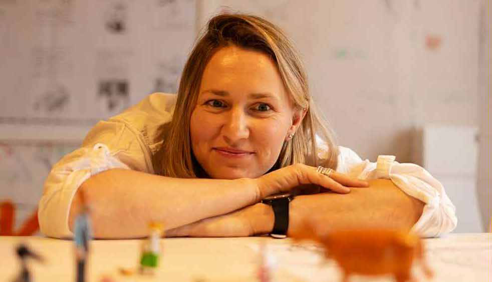
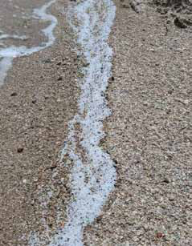

# "The Quiet Power of Words”: Jaffna Monitor Speaks with Nadia Kandrusevich

Jaffna Monitor
hellojaffnamonitor@gmail.com
56
J
affna Monitor speaks to Nadia 
Kandrusevich-children’s book publisher 
and co-recipient of the 2024 IPA Prix 
Voltaire-about censorship, courage, and why 
quiet storytelling can be the loudest form of 
resistance.
The IPA Prix Voltaire honours publishers who 
have faced pressure, threats, and harassment 
in the pursuit of free expression. When you 
learned you had been named a co-recipient, 
what was your immediate reaction? What does 
this recognition mean to you personally-and to 
the wider community of Belarusian publishers 
still resisting censorship? The award citation 
spoke of the “quiet power of words to shape 
minds, open hearts, and build bridges across 
languages, cultures, and generations.” Do you 
feel your work-especially with young readers-
embodies that quiet power?
Jaffna Monitor posed these questions to Nadia 
Kandrusevich.
She responded:  "When I learned that I had 
been named a co-recipient of the IPA Prix 
"The Quiet Power of Words”: 
Jaffna Monitor Speaks with 
Nadia Kandrusevich
Nadia Kandrusevich
INTERVIEW

Jaffna Monitor
hellojaffnamonitor@gmail.com
57
Voltaire, I felt a deep mix of emotions-honor, 
disbelief, and a quiet sadness. It’s not an 
award anyone sets out to win. It means that 
your work has come under threat simply 
because you chose to publish stories, to speak 
freely, to give voice to something that others 
want silenced. But it also felt like a powerful 
moment of recognition—not just for me, but 
for everyone who has worked in Belarusian 
publishing under pressure, in exile, or in 
hiding.
It felt like the world was finally saying: we 
see you, and we know what you’re fighting 
for. Personally, the award is a reminder that 
our work matters, even when it feels small or 
vulnerable. It’s easy to doubt yourself when 
you’re working far from home, when you 
face roadblocks, when you wonder if your 
books will reach the children they were meant 
for. This recognition gives strength. It tells 
me-and others like me-that quiet, persistent 
work can have a lasting impact. The words 
in the citation-“the quiet power of words to 
shape minds, open hearts, and build bridges”-
because that’s exactly how I see the mission 
of children’s literature. When we publish a 
story in Belarusian, we’re not just printing 
pages; we’re creating a space where a child 
can feel seen, heard, and connected to their 
language and culture. It’s not loud, it’s not 
confrontational—but it is powerful. Yes, I do 
believe my work embodies that quiet power.
In a world that often rewards noise and 
spectacle, there is a different kind of strength 
in gently telling a child: Your language is 
beautiful. Your stories matter. You belong. 
That’s how bridges are built—not just across 
borders, but across generations. And in times 
like these, that quiet power may be the most 
important thing we have.
Monitor Memo
L
arge quantities of plastic 
nurdles—tiny raw pellets 
used in plastic manufacturing—
have washed ashore along 
multiple coastal areas in Jaffna's 
island regions, raising serious 
environmental concerns.
District officers from the 
Marine Environment Protection 
Authority (MEPA) and local 
fishing communities report 
significant deposits along 
Pungudutivu's southern 
coastline, as well as in 
Kurikattuwan, Nainativu, and 
Neduntheevu, including the 
latter's vulnerable white sand 
beaches.
These industrial-grade 
microplastics pose substantial 
risks to marine ecosystems 
and the food chain, potentially 
affecting both marine life and 
human consumers through 
contaminated fisheries.
"This is not ordinary plastic 
waste," an environmental 
officer told Jaffna Monitor. 
"Their presence in such volume 
suggests they may have been 
discharged during shipping or 
improperly disposed of at sea."
The spill's origin remains 
unknown, highlighting concerns 
about maritime pollution 
controls along regional shipping 
routes. Environmental groups 
warn of potential long-term 
damage to Jaffna's coastal 
biodiversity without swift 
containment action.
Plastic Nurdles Wash Ashore 
Across Jaffna's Island Coasts

