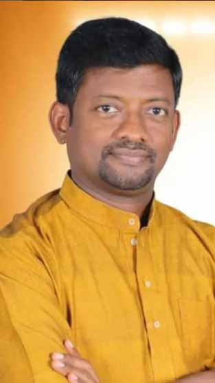
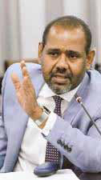

# Monitor Memo

Jaffna Monitor
hellojaffnamonitor@gmail.com
58
Monitor Memo
“
Why does 
Gajendrakumar 
Ponnambalam—
leader of the Tamil 
National People’s 
Front (TNPF) and 
General Secretary of 
the All Ceylon Tamil 
Congress—choose to 
focus on ‘genocide’ 
and ‘ethnic cleansing,’ 
but not address 
‘war crimes’?” asked 
senior ITAK figure 
and Sumanthiran’s 
close confidant, 
Advocate Kesavan 
Sajanthan.
In a televised debate 
featuring TNPF’s 
S. Kajendren and 
Sajanthan himself, 
the latter offered one 
possible explanation. 
He pointed out that 
during the final phase 
of Sri Lanka’s civil 
war, several senior 
officials from the 
LTTE’s political and 
peace secretariat—
including Nadesan 
and Pulidevan—
surrendered while 
carrying white flags. 
Why Emphasize 
‘Genocide’ Over 
‘War Crimes’? 
Sajanthan Questions 
Gajendrakumar

Jaffna Monitor
hellojaffnamonitor@gmail.com
59
Despite this, they were reportedly executed by 
the Sri Lankan Army.
According to Sajanthan, Gajendrakumar 
Ponnambalam is believed to have played 
a mediatory role during these surrender 
negotiations. He reportedly urged LTTE 
leaders to surrender at a designated time 
and place, carrying white flags, as part of an 
understanding reached between the LTTE and 
the Mahinda Rajapaksa government.
“War crimes don’t refer only to violations 
committed against civilians,” Sajanthan stated. 
“They also include how the military treated 
the opposing side during the war—especially 
those who surrendered. The treatment of 
LTTE cadres who came forward with white 
flags falls squarely within the scope of war 
crimes. Even if someone is a combatant, once 
they surrender, they must not be treated 
inhumanely or in violation of international 
humanitarian law.”
He went on to argue that Gajendrakumar’s 
role in the white flag incident places him in a 
morally and legally significant position.
“If there were a serious investigation into war 
crimes—particularly one focusing on what 
happened to those who surrendered—he 
would be a key witness. But to this day, he 
has remained silent. That’s why he will never 
support a genuine investigation into war 
crimes. Because such an inquiry would compel 
him to reveal what really happened during that 
time.”
Sajanthan continued: “A credible investigation 
into the white flag incident would raise critical 
questions: What exactly happened in those 
final hours? What was Gajendrakumar’s role? 
Why has he remained silent until now? These 
are questions he would be obligated to answer. 
That’s why he avoids the war crimes discourse 
and instead shifts focus to the broader—and 
less personally implicating—narrative of 
genocide.”
The so-called “white flag” incident has been 
the subject of international attention for 
years, including in UN expert reports and 
investigative journalism such as Channel 
4’s 2011 documentary Sri Lanka’s Killing 
Fields, which spotlighted alleged extrajudicial 
executions of surrendering LTTE members.
Political observers argue that rather than 
sidestepping these allegations or engaging 
in deflection, Gajendrakumar must come 
forward with a transparent explanation. Did 
he genuinely play a part in encouraging LTTE 
leaders to surrender in hopes of protecting 
them? Was he misled by Sri Lankan state 
actors? What communication took place 
between him and the LTTE leadership at the 
time?
If he continues to conceal the truth, critics 
warn, his moral authority to accuse other 
political leaders of complicity, deception, or 
betrayal will be seriously undermined.
As of publication, Gajendrakumar 
Ponnambalam has not publicly responded to 
these allegations.

