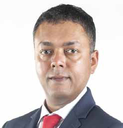
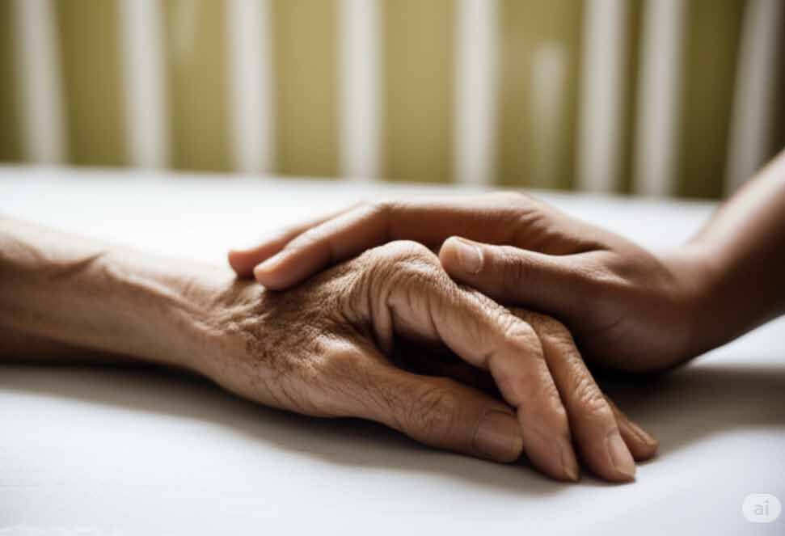

# A Beacon Amidst the Bleeding: What Jaffna’s Doctors Taught Me About Life

Jaffna Monitor
hellojaffnamonitor@gmail.com
60
I
’ve spent most of my adult life building things. 
Businesses, brands, homes, arguments. Always 
chasing—the next goal, the next deal, the next piece 
of validation in a world that measures worth by 
margins and milestones. But this past week, watching 
my mother fight for her life in a small hospital in 
northern Sri Lanka, I was reminded of something I 
had forgotten: not all heroes chase.
It began in Kumulamunai. A heart attack. A real 
one. Silent but severe. My mother—diabetic, 
hypertensive, and until that moment, unstoppable—
suffered what doctors later described as a near-total 
A Beacon Amidst the Bleeding: 
What Jaffna’s Doctors 
Taught Me About Life
BY:  Abbi Kanthasamy

Jaffna Monitor
hellojaffnamonitor@gmail.com
61
occlusion. A 99% block in the right circumflex 
artery. She had been slipping quietly into 
danger for days. No textbook symptoms. No 
drama. Just a quiet march toward a cliff.
The team at Mullaitivu Hospital moved with 
speed and certainty. They administered a 
thrombolytic agent—what the rest of us call a 
“clot buster”—and bought her precious time. 
She was then transferred across district lines 
to Jaffna, where a team of doctors and nurses, 
in a system with barely enough gloves to go 
around, performed a high-stakes angioplasty 
and placed a stent that saved her life. Not once 
did I hear the word “payment.” Not once did I 
feel we were anything but in capable hands.
Now here’s the part that truly knocked the 
wind out of me: they didn’t have to do any of 
it. Two thousand doctors have left Sri Lanka 
in the past three years. They’ve gone to the 
UK, Australia, the Middle East—anywhere 
that offers better pay, better hours, better 
everything. The doctors who stayed behind? 
They’re the outliers. The stubborn. The 
selfless. The ones who choose purpose over 
perks.
I spent time with them. I watched them scrub 
in and out without a pause, without fanfare, 
without complaint. I saw a cardiologist 
explain a procedure to an elderly villager 
in fluent Tamil, without condescension. I 
watched a nurse adjust a patient’s pillow like 
she was tucking in her own child. I saw joy in 
the act of healing—real joy, not performative 
compassion. And I realised something quietly 
devastating: these people are happier than 
most of us.
There is peace in purpose. A kind of wealth 
that isn’t counted in digits but in dignity. And 
it is abundant here.
My mother was in the ER in Canada just 
weeks before this trip. High blood pressure. 
Worrying signs. But the system—hamstrung 
by protocol and overregulation—missed the 
looming heart attack. The very thing that a 
government hospital in war-scarred, budget-
strapped northern Sri Lanka caught and 
treated with surgical precision. I don’t say this 
to score points. I say it because it humbled me.
We often talk about what’s broken in Sri 
Lanka. We talk about corruption, collapse, 
and crisis. And there’s truth in that. But 
somewhere amid the bureaucracy and broken 
roads is a public healthcare system that works. 
That shines. That makes you proud. And 
sometimes, it takes a stent in your mother’s 
heart to see it clearly.
To those doctors in Jaffna and Mullaitivu - 
to the nurses, the orderlies, the drivers who 
transported her between towns and hope—I 
owe more than gratitude. I owe perspective.
We may have built a world that worships 
money. But in those fluorescent-lit hospital 
wards, I met people who worship life.
And they are the richer for it.

